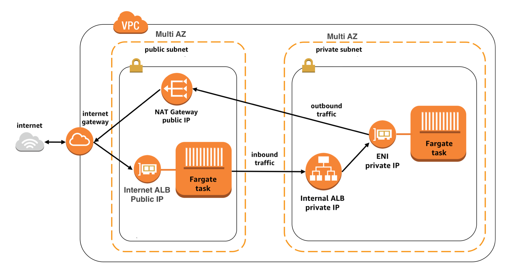

# Pulumi AWS Infrastructure Repo

This repository contains a Pulumi program that deploys a sample AWS infrastructure using ECS, ECR, VPC, and Load Balancer resources. It is developed in Python, using the Pulumi AWS SDK.

Infrastructure Diagram


Key Features
1. This program builds and publishes Docker images using ECR repositories and Dockerfiles for a web UI and a web API.
2. It creates a VPC, public and private subnets, and an internet gateway.
3. It generates two ECS services, one for the web UI and one for the web API, each with their own load balancer and security group.
4. The services run on an ECS cluster with the FARGATE launch type, enabling them to be run without the need to manage servers or clusters.

Prerequisites
Before running this program, ensure you have the following:
1. Python 3.6 or later
2. Pulumi CLI
3. AWS Account and configured AWS credentials, Prepare for a IAM user (iac_user) with sufficent permission for the depployment

Quick Start
1. Clone this repository and navigate to the repo's root directory in your terminal.

```
git clone https://github.com/your-username/your-repo-name.git
cd your-repo-name
```

2. Install the required Python packages:
```
pip install -r requirements.txt
```

3. Set your AWS region e.g:
```
pulumi config set aws:region us-west-2
```
4. Modify whatever images you would like to build/deploy and deploy the stack:
```
pulumi up
```

The pulumi up command creates and updates resources in your stack. You will be prompted to confirm these actions before they occur.

After the stack has been deployed, Pulumi will print out the URL of the load balancer. Visit the URL to view the web UI.

5. Clean up your resources:
```
pulumi destroy
```
Remember to destroy your resources when you're done to avoid unnecessary AWS charges!

# Githubaction is enabled